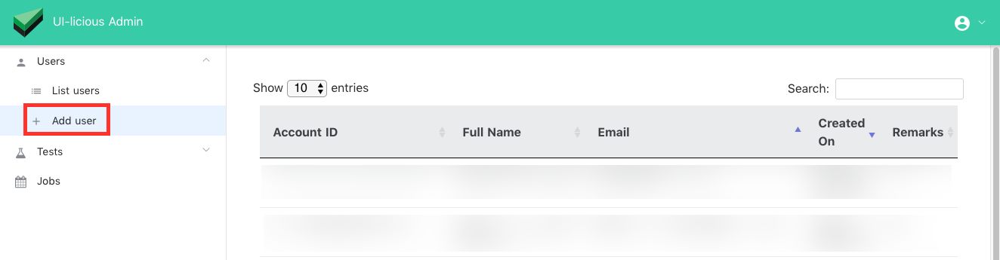
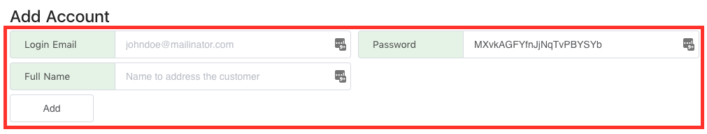
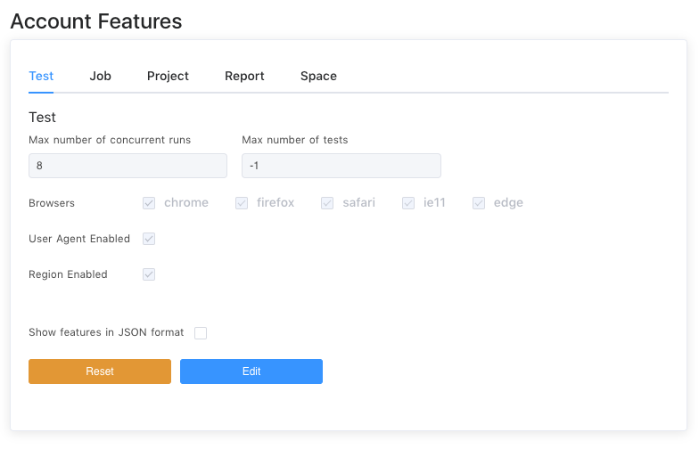

# Signup using Admin Account

> Self Hosted installation only : The following is restricted the superuser admin access only

1 - Login as an adminstrator, into the admin panel. And click on `Add User`

	

2 - Fill in the various basic account details, a random password is automatically generated for convinence. And click the `Add` button.

	

3 - After which you may optionally adjust the various account features, such as permitted browsers, and maximum browser concurrencies.

	

