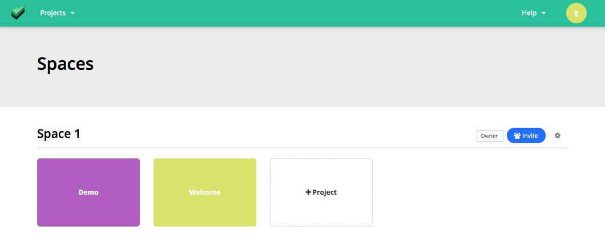

# Self-Serve Signup

> Self Hosted installation only : "Self-serve" maybe disabled in your installations, by your admin.

1 - From the login screen, you should be able to see the `Register` button.

2 - Fill in your respective account details of `email`, `name`, `password`, and click `register`

3 - You will see a loading page, which will redirect you to the teams space dashboard when ready

