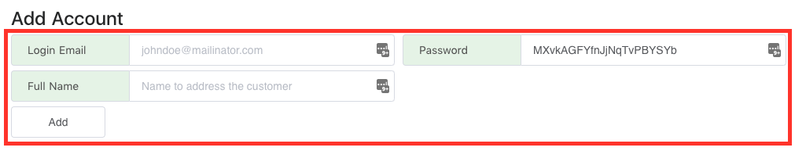
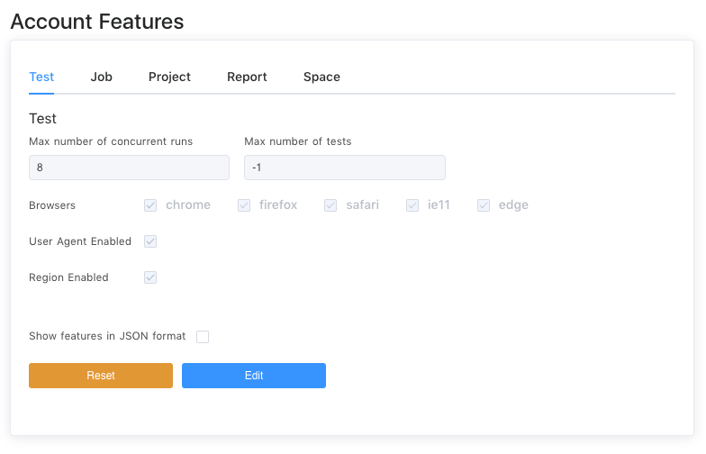

> Self Hosted installation only : the following instructions was developed sepcifically for Self-Hosted installations.
> "Self-serve" maybe disabled in your installations, by your admin.

# Self-Serve Signup

1 - From the login screen, you should be able to see the `Register` button.

2 - Fill in your respective account details, and 'register'

# Signup using Admin Account

1 - Login as an adminstrator, into the admin panel. And click on `Add User`

2 - Fill in the various basic account details, a random password is automatically generated for convinence. And click the `Add` button.

3 - After which you may optionally adjust the various account features, such as permitted browsers, and maximum browser concurrencies.

