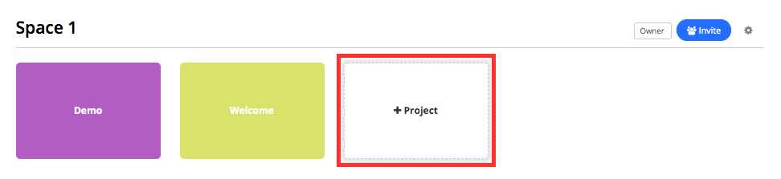
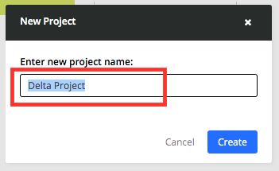
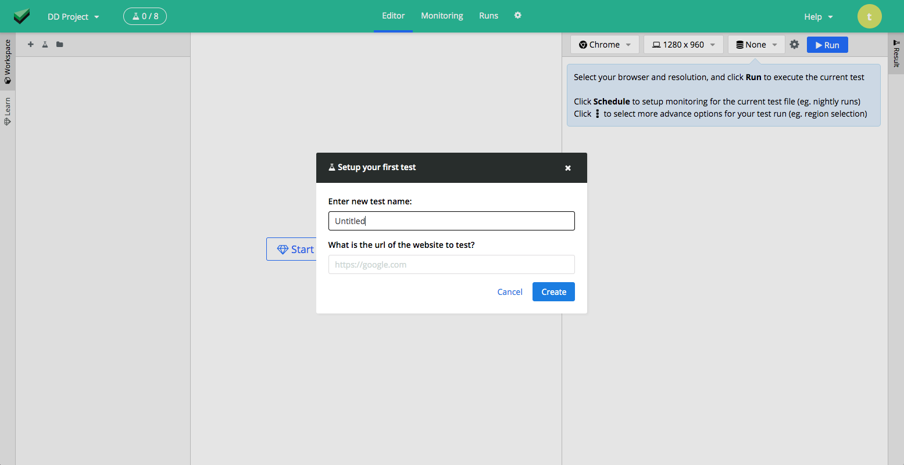

# Adding new project to a team space

Login as either the space admin or owner.

And select the `+ Project` button

Fill in the project name and click on `create`

After which you should see the editor for the project, with a setup prompt.

You can choose to fill it up, or dimiss it.