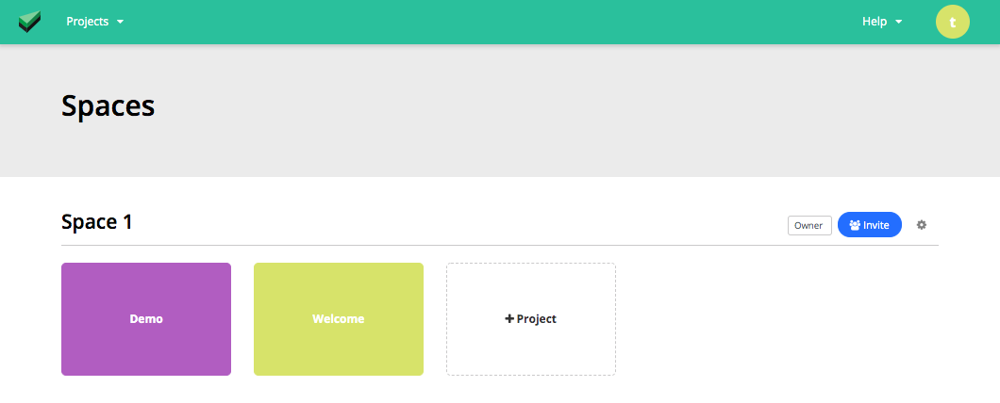
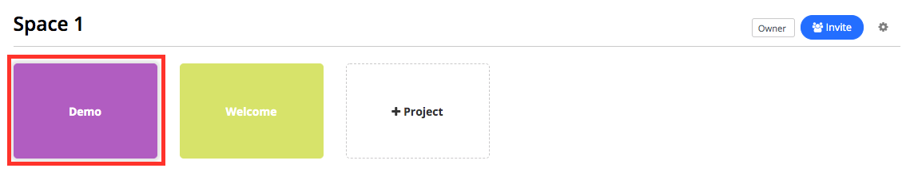
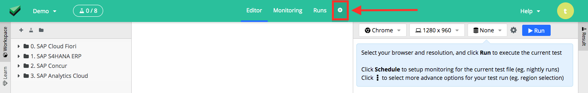
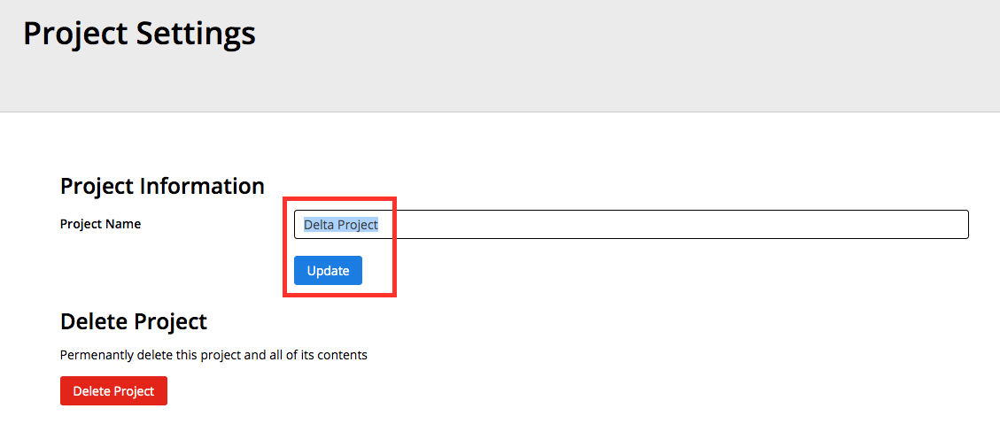

# Rename an existing project

Login as either the space admin or owner.

	

	

Select the project you intent to rename

	

	

Inside the web studio editor, click the project settings `gear` icon

	

	

Within the settings, rename accordingly

	

	

And remember to click `update`