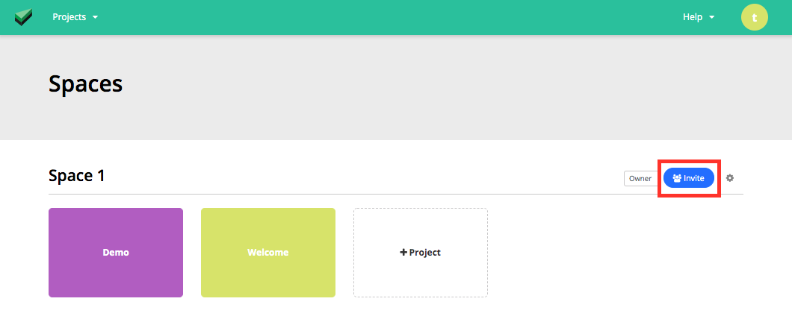
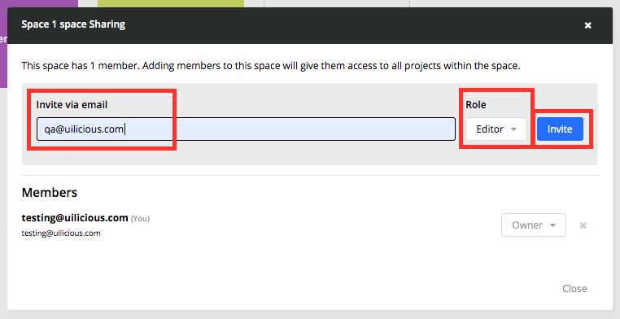
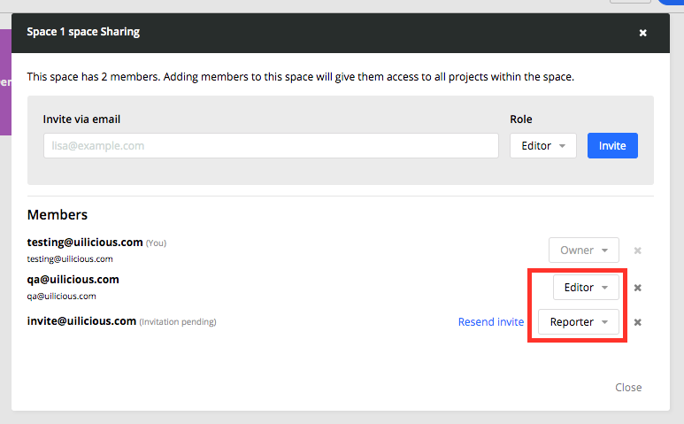
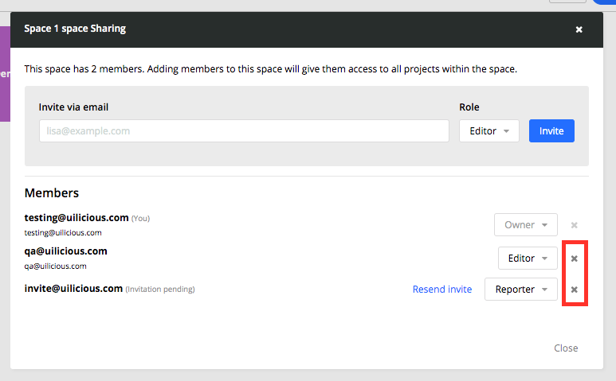
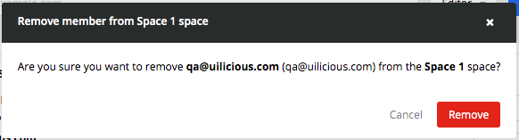

# Add/Remove/Modify users in team spaces

Login as either the space admin or owner, and select the `invite` button.

To add users, Fill in the account `email`, and its desired `role`, and click `invite`

To modify an existing invitation or member `role`, you can select the respective dropdown options.

To remove an existing invitation or member, click on the respective `x` button

And confirm the action

