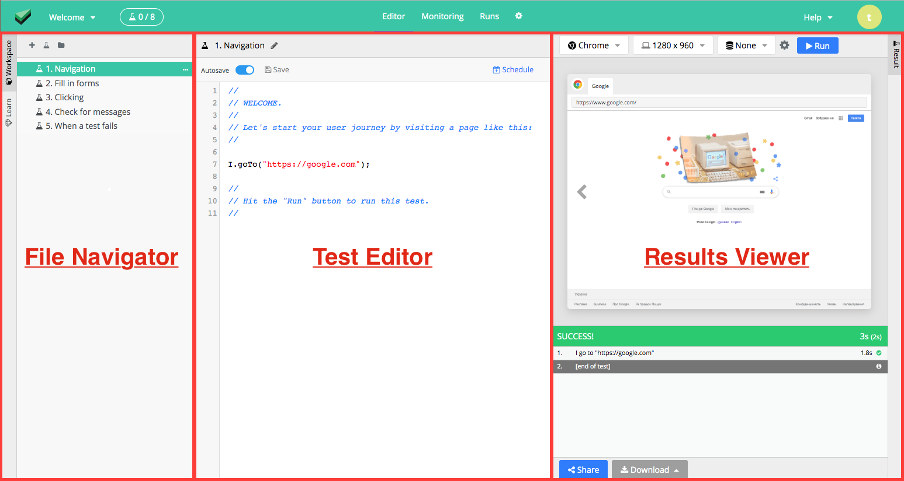
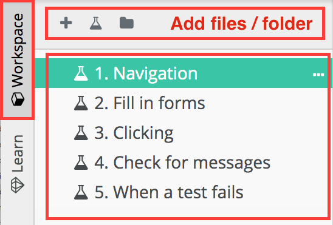
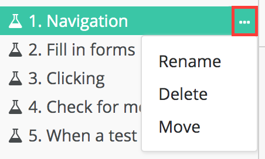
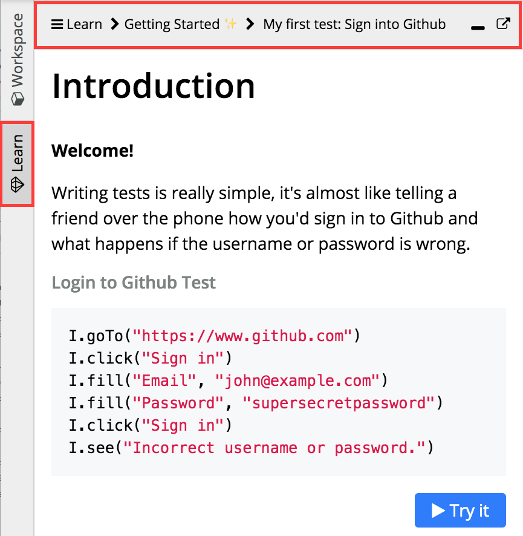
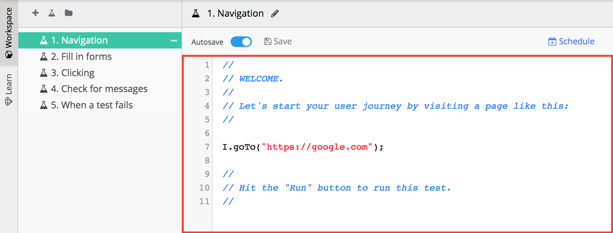
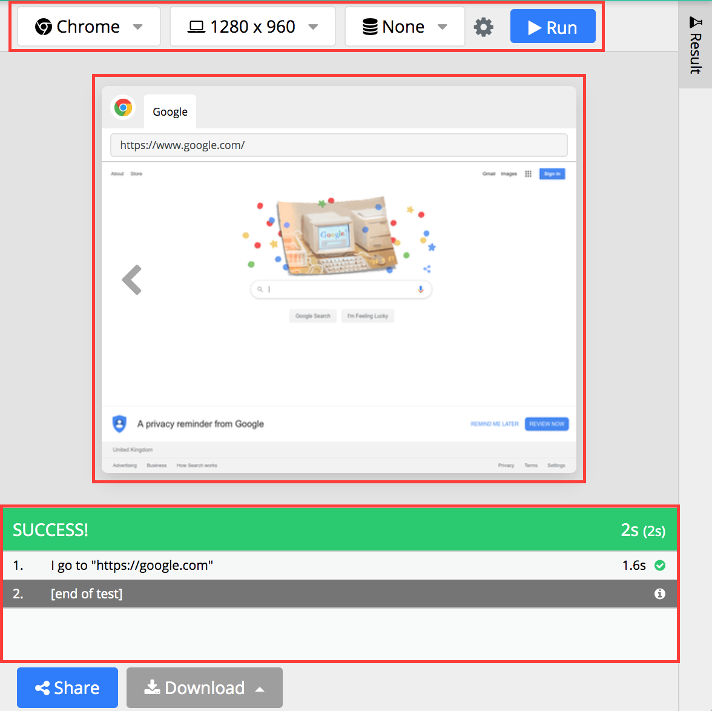
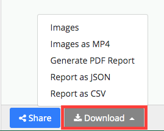
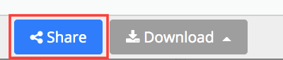
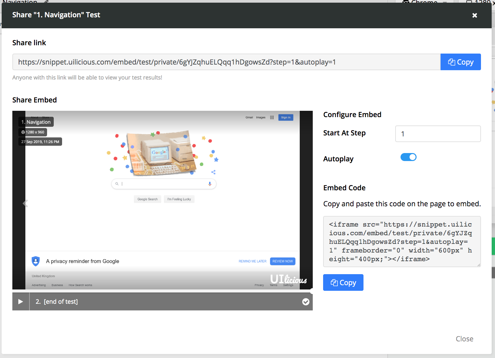
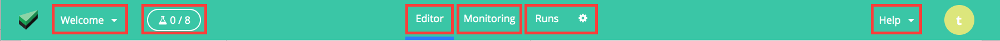

> If you like to jump straight to the commands, head over to [List of commands](scripting/list_of_commands.md) instead.
>
> This segment is meant to cover the basic navigations after login, to help new users get started, in exploring around.

# Basic Webstudio Navigation

When you login to the platform - you will be directed to the `team spaces` dashboard.

	

	

From here you can select any of the existing project (like the one highlighted red)

	

	

Once selected, you will be brought over the the `project editor`.

Which is split into 3 segments. 
- The left `file navigator`
- the center `code editor`, and 
- the right `results viewer` panel.

	

	

In the left `file navigator` panel. You can either 
- open/close it by clicking on the `workspace` button
- add a file or folder, using one of the icons at the top
- select any file in the project (the currently selected file is highlight in green)

	

You can also perform several actions on a file, such as `rename`, `delete` or `move` by clicking on its triple dot icon beside the respective file, and selecting the respectively.

	

Alternatively in the left panel, you can navigate an inbuilt tutorial
- open/close the `learn` tab, by clicking on the `learn` button.
- navigate the learn guide using the top bar
- follow the tutorial content, and executes its scripts with the `Try It` buttons

This is incredibly useful for new users to learn the various basic commands.

	

Once you have a file selected, in the file panel. The respective file will be loaded into the editor, where you can freely modify your scripts

	

Once you are happy with your script, you can execute it using the right `results viewer` panel, which consist of the following
- various browser and resolution options, and the `run` button
- a screenshot preview of the current/selected test step
- a list of various test steps executed (by run), and its overall results

	

Further more, you can generate various sharable reports based on the test results using the `download` button

	

Alternatively, you can click on the `share` button, to generate a sharable link containing only the test result. Which you can let other users see - without login. Useful to put into bug reports, etc.

	

	

Finally in the top panel, you can access the following
- List of various projects
- List of currently running tests
- The test editor
- Scheduled test jobs
- Run history, and project settings
- This help doc

	

---

At this point you should have enough, to start following the various tutorials, and explore the various [list of commands](scripting/list_of_commands.md). 

And more impotantly, enough to start write your own test. 

So feel free to explore around, and start testing.

~ Cheers!