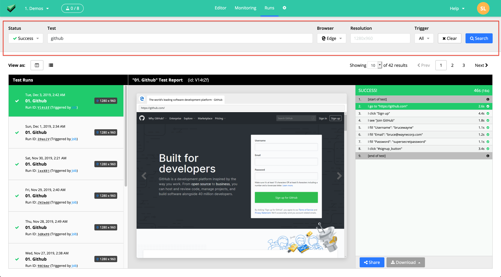
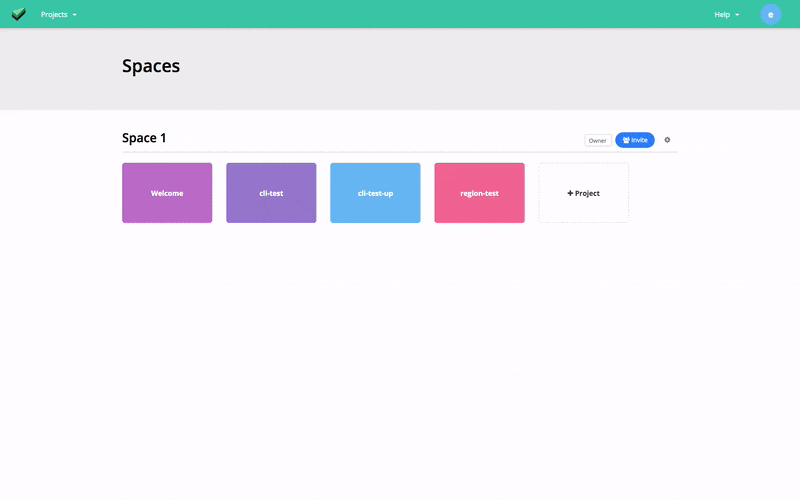
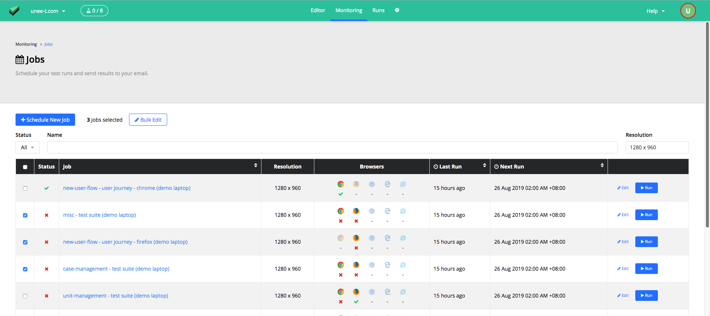
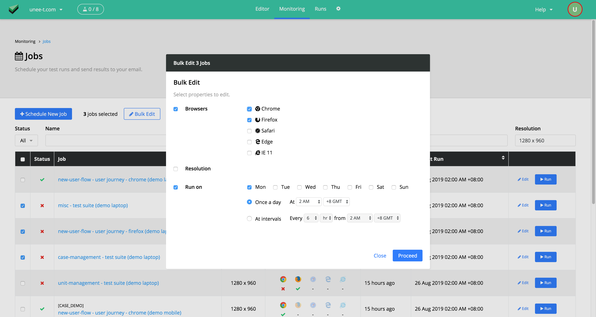

# Release Notes

> To see what's coming up, check out our [roadmap](https://trello.com/b/G80eoZU3/ui-licious-development-roadmap).

> For feedback and suggestions, drop us a line at [support@uilicious.com](mailto:support@uilicious.com).

**How the version numbers mean:**

&lt;Major&gt;.&lt;Minor&gt;.&lt;Patch&gt;

* Major: Contains breaking changes
* Minor: Contains new features
* Patch: Contains enhancements and bug fixes only

### 3.0.0
*Released on 14 Apr 2020*

This release contains a minor breaking change that only affects you if you've used `TEST.loadDataFromCsv` with only the `file` parameter passed in to read a CSV file with exactly one entry. See details below.

[View TEST.loadDataFromCsv documentation](/scripting/load_data_from_file.md#testloaddatafromcsv)

##### ❗️ Breaking Changes

* Previously, `TEST.loadDataFromCsv(file)` could be used to read a CSV with exactly one entry. As this is an uncommon use case and support to read all entries in an CSV is a popular request, it made more sense for `TEST.loadDataFromCsv` to load all entries if `dataset` parameter is not provided, `TEST.loadDataFromCsv(file)` will now return all entries as a JSON object array instead. If your tests are failing due to this change, you need to update your test like this: 
  ```javascript
  // this will no longer work
  var admin = TEST.loadDataFromCsv("admin_user.csv") 

  // fix by adding [0] to read the first element from the returned array
  var admin = TEST.loadDataFromCsv("admin_user.csv")[0]
  ```

##### 🐞 Fixes

* Fix bug with processing `TEST.loadDataFromCsv(file, options)` method signature.
* Fix bug with handling CSV files with exactly 2 rows and 2 columns.

### 2.23.12
*Released on 27 Mar 2020*

##### 💪 Enhancement:

* You can now bulk edit notifications settings for jobs from the Monitoring dashboard.

### 2.23.11
*Released on 24 Mar 2020*

##### 💪 Enhancement:

* Studio - Spaces:
  * Renamed the "Invite" button to "Manage members" button because it wasn't obvious that the button opens the controls for editting and removing team members as well.

##### 🐞 Fixes

* Studio - Editor:
  * Fix bug with failed steps with error supressions are being included in the error count.

### 2.23.10
*Released on 20 Mar 2020*

##### 🐞 Fixes

* Studio
  * Fix bug with "Try it" button on "Learn" pane not working
* Test Engine:
  * Fix issue with I.click missing the target element on websites where the layout changes on scroll.
  * Fix missing return value for click, select, deselect, and drag commands - these commands will return `true` or `false` depending on where the action was performed successfully or not. E.g. `false` will be returned if the target element is not found.

### 2.23.9
*Released on 16 Mar 2020*

##### 💪 Enhancement:

* Email reports:
  * Display test run time in more human-friendly way (now it shows 4:00 PM GMT+8 instead of 16:00 +0800)

##### 🐞 Fixes

* Email reports:
  * Fix issues with processing failed tests steps caused by non-assertion errors, causing some Test Failure reports to be unsent.
  * Fix bug were timezone offset for test run time was incorrectly computed
  * Display test run time in more human-friendly way (now it shows 4:00 PM GMT+8 instead of 16:00 +0800)

### 2.23.8
*Released on 12 Mar 2020*

##### 🐞 Fixes

* Fix issues with `I.click` targeting elements in scrollable dropdown menus.

### 2.23.7
*Released on 04 Mar 2020*

##### 💪 Enhancement:

* Testing nested iframe elements is now supported - using nested `UI.context`

##### 🐞 Fixes

* Fix bug where the first command used in `UI.context` will always fail when used to target an iframe.

### 2.23.6
*Released on 02 Mar 2020*

##### 🐞 Fixes

* Fix bug with `I.click` not working on elements in iframes on Chrome 80.

### 2.23.5
*Released on 28 Feb 2020*

##### 🐞 Fixes

* Fix bug where PDF report show test run start time as 1 Jan 1970
* (On-premise only) Fix link to PDF reports 
  
### 2.23.4
*Released on 20 Feb 2020*

_Several fixes for edge cases with click operations, and other minor fixes and improvements in the Test Engine._

##### 💪 Enhancement:

* Test Engine:
    * Improve error handling for UI.execute so that it reports the actual javascript error now instead of a generic error. 
* Studio:
    * Minor performance improvements to reduce time to load UI-licious Studio

##### 🐞 Fixes

* Test Engine:
    * Fix evaluation of XPATH selectors in **IE11** tests 
    * Fix edge case issues with targeting element using coordinates or pixel offsets from target elements using `I.click(x,y)` and `I.click(target, x, y)`
    * Fix edge case issues with `I.rightClick`
    * Fix edge case issues with `I.click` on Salesforce navigation bar and dropdown components
    * Fix incorrect information about browser tabs and current page url being reported when `I.click` triggers a page navigation. Previously, I.click will show the screenshot taken **before** the click operation, but reports the browser tabs and current page url **after** the click operation instead. Now I.click commands will report the screenshot, browser tabs, and current page url **before** the click operation.
    * Fix bug where browser tabs and current page url does not update after `I.closeTab` commands are used 

### 2.23.3
*Released on 11 Feb 2020*

##### 💪 Enhancement:
* Spaces:
    * Clicking on the UI-licious Cake logo should bring you to the Spaces page without doing a full page reload
    * Spaces can be renamed directly by click on the name of the space on the Spaces page *[Only for Space Owner roles]*
* Editor:
    * Added preview for .md files
* Monitoring:
    * Added dropdown menu with quick actions to disable or delete a job from the Job list page.

##### 🐞 Fixes
* Editor:
    * Fix broken layout when viewing an image in the project files in Editor

### 2.23.2
*Released on 14 Jan 2020*

##### 🐞 Fixes
 * Fix bug with tests not being ran with the selected dataset for users with the Editor role. 

### 2.23.1
*Released on 10 Jan 2020*

##### 💪 Enhancement:
* Editor:
    * New syntax highlighting theme to make it easier to read and understand test scripts
* Test Engine:
    * Performance improvements during test initialising process. Projects that were very large were experience issues with very slow starts and occasionally timeouts due to the slow down.

### 2.23.0
*Released on 12 Dec 2019*

_Major update to the test-engine - we've added `I.hoverOn` and `I.rightClick` command, ability to send chords in `I.press` and `I.type`, and fixed several issues._

##### 🚀 New Features:
* New commands:
  * [`I.hoverOn`](scripting/mouse.md#ihoveron) lets you hover on target elements, e.g. `I.hoverOn("Help")`, `I.hoverOn(".menu")`
  * [`I.rightClick`](scripting/mouse.md#irightclick) lets you press right mouse button on target element. However, if the action opens the default OS context menu, there is no way to interact with this menu or to take a screenshot of it. This command should only be used if you have a custom behavior for the element on right click. 
* `I.press` and `I.type` now supports key chords, e.g. `I.press(["Alt", "r"])` will press "Alt" and "r" keys together.

##### 🧪 Experimental (currently under Beta):
* [Applitools](https://applitools.com/) Integration: 
  * Added method to enable setting stitch mode for full page screenshots.

##### 🐞 Fixes
* Fixed issue with clearing fields with `I.clear` or `I.fill("my field", "")` commands on right-aligned fields or fields with values in RTL languages.
* Fixed issue with test crashing when new tab to specific websites are opened
* Fixed issue with `I.dontSee` always returning `false` - it should return `true` when target is not visible.
* Fixed: improved error message if element cannot be found for `I.getText` and `I.getValue` commands
* Fixed issue with alerts being auto-dismissed by default on Firefox
* Fixed issue with test crashing when alerts are opened on Safari and IE11.

### 2.22.1
*Released on 28 Nov 2019*

##### 🐞 Fixes
* Fixed issue with UI showing no controls when the last project in the space is deleted.

### 2.22.0
*Released on 13 Nov 2019*


##### 🧪 Experimental (currently under Beta):
* Integration with [Applitools](https://applitools.com/) for visual regression testing

### 2.21.1
*Released on 4 Nov 2019*

##### 💪 Enhancement:
* __Editor__: Pressing the "Stop" button now releases the Report pane immediately instead of waiting for the test run to be fully stopped, so that you can immediately execute another test.

##### 🐞 Fixes
* Fixed issue on "Manage Datasets" modal cannot be scrolled
* Fixed issue with newly created jobs showing last run time as 1 Jan 1970.
* Fixed layout on "Monitoring" tab to accomodate narrow screen sizes.

### 2.21.0
*Released on 25 Oct 2019*

<video autoplay loop muted width="300px">
    <source src="./images/editor/code-hinting.mov" type="video/mp4">
</video>

##### 🚀 New Features:

* __Editor__: Code hinting and auto complete is available as you type! 
* __Browser Notifications__: Get browser notifications whenever tests (triggered manually from the Editor) are completed.

##### 💪 Enhancement:
* __Jobs__: 
  * You can now get a quick glance of the schedule configured for a job on the Monitoring tab
  * Dates are now displayed in localised format.

##### 🐞 Fixes
* __Runs page__: Fixed Enter key support for submitting search query on the test runs

### 2.20.1
*Released on 14 Oct 2019*

<div class="screenshot">
    
</div>

##### 💪 Enhancement:
* __Runs page__: Added filters for searching test runs by Name, Status, Browser, and Trigger.

##### 🐞 Fixes
* __Runs page__: Fixed issue with pending test run reports not updating automatically.

### 2.20.0
*Released on 8 Oct 2019*


##### 🚀 New Features:
* __Jobs__: Integration with Microsoft Teams now supported - you can now get error reports sent straight to your channels in MS Teams.

### 2.19.3
*Released on 2 Oct 2019*

##### 💪 Enhancement:
* __Jobs__: You can now enable / disable jobs to temporarily pause them. 

### 2.19.2
*Released on 23 Sept 2019*

##### 💪 Enhancement:
* __Spaces page__: (For cloud edition) Added tag to display subscription plan for each space

### 2.19.1
*Released on 11 Sept 2019*

##### 💪 Enhancement:
* __Reporter role__: You can invite a team member as a Reporter. Reporters may only view reports.
* __Spaces page__: Add indicator of your role in each space.

### 2.19.0
*Released on 06 Sept 2019*

<div class="screenshot">
    
</div>

##### 🚀 New Features:
* __Spaces & Teams__: You can now invite your team members to your Space (your collection of projects) as Editors! Editors may create, edit, run tests and schedule jobs, but may not manage users or billing. 

##### 💪 Enhancement:
* __Editor Tab__:
  * Added preview for your image files
  * Added icons to help you differentiate between different files types

### 2.18.8
*Released on 26 Aug 2019*
##### 💪 Enhancement:

_We've made the Monitoring Dashboard richer to help you identify problems faster!_

<div class="screenshot">
    
</div>

* __Latest results at a glance__: You can now see the latest result for each job at a glance, and click on the status to view the report directly.
* __More Info and Actions__:
    * Added the browser, resolution, and dataset configuration information for each job to help you differentiate similar jobs at a glance.
    * Added the "Edit" button to allow you to edit your Job configuration without leaving the Jobs list page.
* __New Filters__:
    * Added the resolution filter.

<div class="screenshot">
    
</div>
* __Bulk edit__:
    * You can now select multiple jobs and bulk edit the browsers, resolutions, and schedule configurations for the selected jobs.

### 2.18.7
*Released on 22 Aug 2019*

##### 🐞 Fixes
* Drag and drop commands:
  * Fixed issues with the drag commands on implementations of the Drag and Drop UI where the original drag element is destroyed after dragging.

### 2.18.6
*Released on 16 Aug 2019*

##### 🐞 Fixes
* Drag and drop commands:
  * Fixed issues with the drag commands on various implementations of the Drag and Drop UI, including:
    * Native HTML5 implementations
    * Implementations that creates ghosts during dragging,
    * Implementations that detaches the drag element from its parent during dragging

### 2.18.5
*Released on 8 Aug 2019*
##### 💪 Enhancement:
* PDF reports:
  * Added interaction highlighting to indicate targeted elements for interaction commands.
  * Buffered rendering to improve experience of loading really huge reports

##### 🐞 Fixes
* Reports:
  * Fixed janky scrolling issues when selecting a report step.
  * Fixed Preview Window not resizing to fit on Firefox, Safari, and Edge browsers.
* Run Tab:
  * Fixed list display issue on Safari.
* PDF reports:
  * Fixed overflow issues happening on certain screen sizes and zoom levels.

### 2.18.4
*Released on 1 Aug 2019*

##### 💪 Enhancement:
* Improve performance of retrieving screenshots of the tests

### 2.18.3
*Released on 19 July 2019*
##### 💪 Enhancement:
* Job filters:
  * Added filters to quickly filter jobs by name, and by statuses.

### 2.18.2
*Released on 18 July 2019*
##### 💪 Enhancement:
* Added raw time taken to execute tests, including post-processing time.
  * Previously, we only displayed the time taken to execute a test excluding post-processing time (which includes time taken for capturing screenshots and other telemetry) and other script processing time (for example, if you have a long running loop to compute stuff in between test commands). Depending on the browser used for the test, the post-processing time can be significant. Some users requested for raw time taken in order to accurately predict the total time needed to execute the full test suite.

### 2.18.1
*Released on 24 Jun 2019*

##### 💪 Enhancement:

* Editor: We've made some improvements to the editor to increase your productivity in writing tests.
  * Added hotkeys to quickly comment and uncomment lines using (`CTRL + /`, or `CMD + /` for Mac users)
  * Added hotkeys to quickly indent and un-indent using `TAB` and `SHIFT + TAB`. 
  * Defaults for auto-indentation is now 1 tab instead of 2 spaces (sorry spaces!)
  * Braces and quotes are now automatically closed for your convenience.
* Offline Warning: Display warning if you are currently offline

### 2.18.0
*Released on 23 May 2019*
##### 🚀 New Features:
* Added new commands to assert HTTP status code of the current page:
  * `UI.isStatusCode(code)`, `UI.is200`, `UI.isNot200`, `UI.is404`, `UI.isNot404`, `UI.is500`, `UI.isNot500`
<!-- * `I.goTo` will also now assert that the page does not return an error status code (codes that 400 and above). -->
  <!-- * Added `assertStatusCode` option for use cases where you actually want to assert that page has a specific status code instead -->
  <!-- * If you want to suppress errors for `I.goTo` commands - you can use `I.goTo$` instead. -->

##### 💪 Enhancement:
* Improve report status message for terminated tests - add cause of test termination e.g. stopped by user, reached max test run time limit, reached max concurrency.

### 2.17.3
*Released on 21 May 2019*

##### 🐞 Fixes
* Fixed an issue that causes ESOCKETTIMEOUT errors in the test when a new tab is opened.

### 2.17.2
*Released on 17 May 2019*

##### 💪 Enhancement:
* Update the report for test runs in jobs, replaced with the same report component as the editor for a more consistent look.
* Added 🎨 color to browser icons so that it's faster to visually differentiate browsers

### 2.17.1
*Released on 15 May 2019*

##### 🐞 Fixes
* Fixed: Reports can't be loaded if they are too large (>2000 steps) and crashes the browser instead. Buffered rendering of the report to prevent browser from crashing.

### 2.17.0
*Released on 13 May 2019*

##### 🚀 New Features:
* Added "Runs" tab - We added a new "Runs" tab so that you can view all your previously ran tests in one place.

##### 💪 Enhancement:
* Test reports now shows you which tabs are opened at each step of the test.
* Added browser icon to the preview window in test reports to indicate which browser the test was ran in.

### 2.16.1
*Released on 6 May 2019*

##### 🐞 Fixes
* Fixed: Safari tests freezes whenever native `<select>` dropdowns are opened.

### 2.16.0
*Released on 23 Apr 2019*

##### 🚀 New Features:
* Added "Learn" pane to the editor which contains tutorials and references on how to write UI-liicous test scripts.

##### 💪 Enhancement:
* Added prettier "Running Tests" dropdown to the top nav bar. Removed "Running Tests" drawer at the bottom of the screen. 

##### 🐞 Fixes
* Fix slowdown of tests due to slow merge array function

### 2.15.3
*Released on 1 Apr 2019*

##### 💪 Enhancement:
* Added `TEST.browser`, `TEST.width` and `TEST.height` to expose the settings for the current test run
* Added `I.pressDelete` and `I.pressBackspace` commands for convenience.
* Added `I.clear` to clear input fields (basically the same as `I.fill` using an empty string)

##### 🐞 Fixes
* Fixed issue with scrolling elements into center when elements are within scrollable elements within the page body. Elements within scrollable elements were often scrolled to the top of the screen which caused problems, especially for dropdown elements.
* Fixed issue with `I.fill` command being able to properly clear certain input fields, and instead append the value instead.

### 2.15.2
*Released on 26 Mar 2019*

##### 🐞 Fixes
* Fixed issues with tab handling when alert popups are opened

### 2.15.1
*Released on 25 Mar 2019*

##### 💪 Enhancement:
* Added new SAMPLE commands
  * `SAMPLE.name` - Generate random full name
  * `SAMPLE.last` - Generate random last name
  * `SAMPLE.first` - Generate random first name
  * `SAMPLE.email` - Generate random email address
  * `SAMPLE.phone` - Generate random phone number
* Now you can close tabs with `I.closeTab` command! 😀

### 2.15.0
*Released on 6 Mar 2019*

##### 🚀 New Features:
* Added editing and linting support in the web studio for .json, .csv, .md files.
* Added new commands for loading test data from .json and .csv files within the project:
  * `TEST.loadDataFromJson`, `TEST.loadDataFromCsv`, `TEST.loadDataFromFile`

##### 💪 Enhancement:
* Retrieval of test run results are now faster and more accurate!

##### 🐞 Fixes
* Fix error handling when user attempt to create a file when it already exists.

### 2.14.2
*Released on 5 Mar 2019*

##### 💪 Enhancement:
* Sort dataset and dataset variables alphabetically. :)

### 2.14.1
*Released on 4 Mar 2019*

##### 💪 Enhancement:
* Improvements to web reports - added controls to allow you to jump directly to errors.

##### 🐞 Fixes
* Fix webhook report - When test fails, the report was showing last 3 steps from the end of the test instead of the last 3 steps from the first error occurrence, which isn't very helpful.

### 2.14.0
*Released on 1 Mar 2019*

##### 🚀 New Features:
* You can now share test run results publicly with an unlisted url and as an embedded iframe.

### 2.13.1
*Released on 29 Jan 2019*

##### 🐞 Fixes
* Fix `UI.context` - `UI-context` was failing when single quotes are used in the selector

### 2.13.0
*Released on 11 Jan 2019*

##### 🚀 New Features:
* You can **download test results as MP4 Video**

### 2.12.1
*Released on 8 Jan 2019*

##### 🐞 Fixes
* Fix `I.seeCount` - the assertion was still passing even if the count is incorrect

### 2.12.0
*Released on 7 Jan 2019*

##### 🚀 New Features:
* Drag and drop commands are now available:
  * `I.dragTo` - Allows you to drag an element to another target element.
  * `I.dragBy` - Allows you to drag an element in a direction using (x,y) pixel offset.
  * `I.dragUp`, `I.dragDown`, `I.dragLeft`, `I.dragRight` - Shortcuts for `I.dragBy`

### 2.11.5
*Released on 12 Dec 2018*

##### 💪 Enhancement:
* Improved performance on the test run history page for individual jobs.

### 2.11.4
*Released on 5 Dec 2018*

##### 💪 Enhancement:
* Added test run durations to reports sent via webhooks.

### 2.11.3
*Released on 30 Nov 2018*

##### 💪 Enhancement:
* `UI.context` can now be used to explicitly switch the context to an iframe. This is useful in cases where security policies on the web application or on specific browsers prevents UI-licious from normally being able to see the contents of iframes and test it.

### 2.11.2
*Released on 25 Nov 2018*

##### 💪 Enhancement:
* `UI.execute` now prints out a snippet of the script to execute to make the test reports and flow easier to understand. And you may also override the log message for `UI.execute`.

### 2.11.1
*Released on 20 Nov 2018*

##### 💪 Enhancement:
* You may now override xpaths and css selectors with more human-friendly labels in reports for every command, please refer to the documentation for each command.

### 2.11.0
*Released on 7 Nov 2018*

##### 🚀 New Features:
* **Datasets**: You can now configure variables for running tests on different environments.
* New commands:
  * `I.getValue` - Allows you to grab the value of an input field and set it to a variable
  * New scroll commands for conveninence - `I.scrollUp`, `I.scrollDown`, `I.scrollLeft`, `I.scrollRight`.
  * **Error supression** - For all `I` and `UI` commands, you can suppress the error with the `$` variant of the command - e.g. `I.see$("Flying pigs")`. This may be useful when you want so suppress the errors for commands used as conditional expressions in `if/else` blocks.
  * Error and **log suppression** - For all `I` and `UI` commands, you can suppress the error and logs with the `$$` variant of the command - e.g. `UI.execute$$(...)`.

##### 💪 Enhancement:
* Better error logging about errors in the test script itself.

### 2.10.0
*Released on 25 Oct 2018*

We'll be taking it slow for the next couple of months for some major refactoring under the hood so that we can write code more efficiently, improve the performance of UI-licious, and support development of features planned in our roadmap.

##### 🚀 New Features:
* **Stop button**. Yes, you have been asking for it. Now there's a way to stop tests.
* You can now see which tests that are currently being ran, how are they triggered, and how many of your concurrent test sessions are being used.

##### 💪 Enhancement:
* Studio - Monitoring View
  * Added sorting controls to the Jobs overview.

### 2.9.0
*Released on 20 Sept 2018*

##### 🚀 New Features:

* Test Engine:
  * You can take full page screenshots with these new configuration and commands:
    * Add `TEST.fullScreenshot` configuration option to set screenshots to be taken as full page screenshots. Set `TEST.fullScreenshot = true` to enable full page screenshots for all subsequent commands. Note that this slows down testing time significantly, you should use it only when necessary.
    * Add `TEST.takeFullScreenshot()` command to take a full page screenshot
* Studio:
  * You can now download test run reports as JSON and CSV.
* (For Enterprise On-Premise):
  * Added views to monitor running tests, all tests, and all scheduled jobs system-wide.

##### 💪 Enhancement:
* Studio - Editor View:
  * You can now share reports of tests ran from the Editor view by grabbing the URL of report.
  * Where `I.fill` is performed on the screen is now highlighted
* Studio - Monitoring View:
  * You can now set the `User Agent` in jobs. This setting currently only works for tests running on Chrome.
  * Added pagination for list of tests ran for a scheduled job to view reports for test ran further back.

##### 🐞 Fixes
* Studio - Editor View:
  * Editor wasn't loading new tests immediately after creation.

### 2.8.0
*Released on 6 Sept 2018

##### Highlights:
* Studio - Editor View:
  * Where `I.click` are performed on the screen is now highlighted. However, screenshots for `I.click` now shows the screen before the click is performed, instead of the screen after the click is performed. If you need to view the screen after the click is performed, simply add another command after `I.click` such as `I.see` to capture the screen after.

##### 🚀 New Features:
* Studio - Editor View:
  * "Autosave" switch to enable / disable autosaving of your test scripts.

##### 💪 Enhancement:
* Studio - Editor View:
  * Added a warning if you try to leave the Editor with unsaved changes to prevent accidental loss of work.
  * For each step in the test report, we've added a "View Test" link so that you can jump to the script for that step.
  *

### 2.7.0
*Released on 29 Aug 2018*

##### 🚀 New Features:
* Test Engine:
  * Added supported for `User-Agent` settings for tests ran on Chrome. You can now set `User-Agent` from the advanced run configuration in "Run" pane in the Studio Editor.
  * New commands for custom logging to support custom functions `TEST.log.info`, `TEST.log.pass`, `TEST.log.fail`.

##### 💪 Enhancement:
* Studio:
  * We've changed our chat and ticketing system from Zendesk to Intercom for a better experience in supporting you. :)

### 2.6.8
*Released on 14 Aug 2018*

##### 🐞 Fixes
* (Chrome, Safari, Edge, IE) Fix `I.doubleClick`
* (Firefox) Fixed bug with `I.click` not working for some elements
* (IE) Fix bug with handling XPATH selector

### 2.6.7
*Released on 10 Aug 2018*

##### 🐞 Fixes
* (Firefox) Fixed bug with `I.click` not working on elements within iframes

### 2.6.6
*Released on 31 Jul 2018*

##### 🐞 Fixes
* (Firefox) Fixed bug with `I.click` not working

### 2.6.5
*Released on 30 Jul 2018*

##### 💪 Enhancements:
* `UI.context` can now handle and target within multiple `context` matches
* Added `I.see.signpost` for more explicit hints to the test engine to resolve similar matches using a related element

### 2.6.4
*Released on 20 Jul 2018*

##### 🐞 Fixes
* (Firefox) Fixed bug typing space characters

### 2.6.3
*Released on 19 Jul 2018*

##### 💪 Enhancements:
* You can now use relative paths for `TEST.run`

### 2.6.2
*Released on 16 Jul 2018*

##### 🐞 Fixes
* Fixed bug typing special characters

### 2.6.2
*Released on 13 Jul 2018*

##### 💪 Enhancements:
* Added workaround to perform keyboard actions on input fields that override values on `input` event causing characters to be erased

### 2.6.1
*Released on 12 Jul 2018*

##### 💪 Enhancements:
* Added `I.clickXY` command to click on an element using (x,y) coordinates

### 2.6.0
*Released on 2 Jul 2018*

##### 🚀 New Features:
* (Beta) You can now select from which region you want to run your test for certain plans  (for Pro users only)
    * Available Regions : Singapore, Frankfurt, California, Taiwan, Japan
    * Support browsers : Chrome, Firefox
* (Beta) You can now run test on Safari (for Pro users only)

##### 🐞 Fixes
* Error test run notification report was missing ❗ from email subject

### 2.5.4
*Released on 1 Jul 2018*

##### 💪 Enhancements:
* Improve `I.select` so that it can handle hidden checkboxes that is styled using an associated label that is visible

### 2.5.3
*Released on 28 Jun 2018*

##### 🐞 Fixes
* (Firefox) Fixed bug in getting element from browser

### 2.5.2
*Released on 13 Jun 2018*

##### 🐞 Fixes
* Fixed error that happens when cancelling rename file action from title bar in the Editor
* Block very edge case race condition where a file will override another

### 2.5.1
*Released on 8 Jun 2018*

##### 💪 Enhancements:
* `I.amAt` - Now supports partial matching of paths and handles RegExp.

### 2.5.0
*Released on 4 Jun 2018*

##### 🚀 New Features:
* Added `I.doubleClick` command

##### 🐞 Fixes
* Fixed `I.amAt` - clean up extra `/` characters before asserting path to prevent incorrect failed assertions
* Fixed `I.filled` - fails to catch errors
* Screenshot does not automatically center target elements for selection commands.

### 2.4.0
*Released on 1 Jun 2018*

##### 🚀 New Features:
* Add `I.count` and `I.getCount` to count elements and assert count of text and elements.
    ```
    Example:
    I.goTo("https://store.com/alcohol");
    I.count("beer", 99); // searchs for 99 occurances of "beer"
    var n = I.getCount("beer"); // gets the number of occurances of "beer" on the page as a variable
    ```

##### 💪 Enhancements:

* Better reports for the Editor Tab
  * Improved design - nicer preview window, better layout for mobile resolution tests
  * There's now URL and page title information for each step
  * You can now download test run screenshots as an animated GIF for up to 100 steps.
* Scheduled jobs:
    * You can now set multiple email address for the job notification emails.
    * Added last 3 steps until first error in error reports sent to Webhooks.
* Test engine:
    * `aria-labelledby` is now evaluated when searching for elements
    * Search expression will now match all variants of single-quotes and double-quotes.

##### 🐞 Fixes
* `I.deselect` and `I.deselected` wasn't working

### 2.3.1
*Released on 18 May 2018*

##### 💪 Enhancements:
* (On-premise only) You can download debugging logs for test runs.

##### 🐞 Fixes
* Some XPATH expressions didn't work
* SSL certificate checks on Firefox was not skipped
* When jobs fail due to network errors, automatically retry the job.

### 2.3.0
*Released on 8 May 2018*

##### 🚀 New Features:
* You can limit search scope by using `UI.context` or providing a `context` option in test commands.

### 2.2.0
*Released on 22 Apr 2018*

##### 🚀 New Features:
*  New commands to assert, accept, cancel, and fill **alert/confirm/prompt** dialogs.

##### 🐞 Fixes
* Unable to set timezone for job schedule sometimes.

### 2.1.13
*Released on 13 Apr 2018*

##### 🚀 New Features:
*  New command `UI.execute` to execute javascript on the browser.

### 2.1.12
*Released on 12 Apr 2018*

##### 💪 Enhancements:
* Improved design for configuring webhook notification

##### 🐞 Fixes
* Webhook notifications was triggering for every test run even when notification is set to send on errors only.
* Unable to disable webhook notification when editing job.

### 2.1.11
*Released on 05 Apr 2018*

##### 💪 Enhancements:
* Advanced options for scheduling jobs (Pro plan only).

### 2.1.10
*Released on 02 Apr 2018*

##### 🚀 New Features:
* You can use webhooks to get notifications about the status of your jobs on your own Slack / Telegram channels.

##### 💪 Enhancements:
* You can now download all the images of a test run from the Editor.

### 2.1.9
*Released on 15 Mar 2018*

##### 🚀 New Features:
* You can now run tests on Microsoft Edge!

##### 💪 Enhancements:
* `I.fill` and `I.click` commands can now target elements by `aria-label`
* You can now target input fields by their current value when using `I.fill`
* Added XPATH support for `I.fill`
* `I.see` and `I.click` now applies to the value and placeholder of textual input fields too
* You can use `I.type` in place of `I.press` for keyboard inputs
* Added `I.pressTab` command

### 2.1.8
*Released on 12 Mar 2018*

##### 🐞 Fixes
* Fix bug that prevented jobs from running.

##### Others:
* Capped maximum run time of tests to 1 day. Tests running longer than that will time out. If you have tests running for such a long time, you should split them into smaller tests.
* Improve performance of retrieving test run results.

### 2.1.7
*Released on 9 Mar 2018*

##### 🐞 Fixes
* Fixed bug that caused application to crash when polling for the status of pending jobs.

### 2.1.6
*Released on 6 Mar 2018*

##### 🚀 New Features:
* 🍪🍪🍪 You can now set and assert [cookies](/scripting/cookies.md).

##### 🐞 Fixes
* Fixed: Jobs being ran and crashing when their tests get moved or deleted.

### 2.1.5
*Released on 20 Feb 2018*

##### 🚀 New Features:
* Added `SAMPLE.id` method for generating sample data for random base58 strings.

### 2.1.4
*Released on 12 Feb 2018*

##### 🐞 Fixes
* Fixed: Unable to retrieve job status sometimes.

### 2.1.3
*Released on 11 Feb 2018*

##### 🐞 Fixes
* Fixed: Cannot open "Create Project" dialog

### 2.1.2
*Released on 6 Feb 2018*

##### 💪 Enhancements:
* Friendly reminders to ask you to pay us for our work. 😉

### 2.1.1
*Released on 27 Jan 2018*

##### 🐞 Fixes
* Fixed: Editor tab - Test report window could not be resized

### 2.1.0
*Released on 23 Jan 2018*

##### 🚀 New Features:
* You can now automatically pay us for our work. 😉

### 2.0.0
*Released on 3 Jan 2018*

##### 🚀 New Features:
* Documentation Tab: Now you can view this documentation site with UI-licious Studio with your tests side-by-side

##### 💪 Enhancements:
* Internal changes to improve the performance of the application and test engine.
* Prettier web reports for your scheduled tests.
* You can specify the full path when creating or moving a file or folder. All intermediate folders to the destination path will be automatically created.

### 1.5.1
*Released on 9 November 2017*

##### 💪 Enhancements:
* Editor Tab:
	* Improved resolutions dropdown in Run pane - group resolutions by device class, and label resolutions by common screen size names
	* Display folder path in Script pane title bar
	* New tests/files/folders will be created as siblings to the currently selected test/file on the Directory pane.
	* When a folder is selected on the Directory pane, the Script pane will not navigate away to a blank page.

##### 🐞 Fixes
* Editor Tab:
	* Fixed: Script pane does not automatically display the new test after creation, when test is created by clicking on the "Create Test" button on the blank Script pane.
	* Fixed: Tests get overridden when the switching between tests while a test is being saved

### 1.5.0
*Released on 11 October 2017*

##### 🚀 New Features:
* **Scheduled tests**: You can schedule tests to run automatically, and send email alerts when there's an error.

##### 💪 Enhancements:
* Reports now show you the total time taken for the entire tests.
* Changes to the color scheme to improve contrast and visibility.

### 1.4.3
*Released on 28 September 2017*
* Improved `I.upload` command to better handle hidden `<input type=file>` fields
* Improved `I.press` command to support active elements within `<iframe>` and `<frame>` elements

### 1.4.2
*Released on 9 September 2017*
* Improved CSS selector support for `I.fill` command

### 1.4.1
*Released on 25 August 2017*
* Improved `I.select` command - Better identification of target element with option parameter alone
* Improved support for testing within `<frame>` elements

### 1.4.0

*Released on 21 August 2017*

#### Breaking Changes
* When `I.click` opens a page in a new tab, the browser will be automatically switched to it.
    * If you are using `I.switchTab` to switch tabs after `I.click`, you can remove `I.switchTab`, or *(not recommended)* add `TEST.autoSwitchTab = false` or `TEST.autoSwitchTabOff()` to the start of your test scripts to disable this behavior.

#### Highlights
* You can set the max duration to attempt a command before raising an error with the `TEST.commandTimeout` setting.

##### New

New Commands:
* Refresh a page: `I.refreshPage`
* Scrolling a page: `I.scrollBy`, `I.scrollTo`, `I.scrollToTop`, `I.scrollToBottom`
* &uarr; &uarr; &darr; &darr; &larr; &rarr; &larr; &rarr; `B` `A` <br>Shortcuts to press arrow keys: `I.pressUp`, `I.pressDown`, `I.pressLeft`, `I.pressRight`

New Configurations:
* You can set the max duration to attempt a command before raising an error with the `TEST.commandTimeout` setting.
* You can enable / disable automatic screenshots taken during test runs with the `TEST.autoScreenshot` flag.
* You can enable / disable automatic tab switching when new tab is open with the `TEST.autoSwitchTab` flag.

##### Enhancements
* Condensed the project directory, so you can see more.
* Asset optimizations to improve load time
* Separate runner pane from script pane so that the runner pane doesn't reload as you switch between different scripts which can be annoying during test runs.

##### Fixes
* Fixed: Layout of UI-licious Studio is broken on Safari.
* Fixed: Error moving files to project root.

### 1.3.0

*Released on 21 June 2017*

* Added support for testing [Web Components](https://www.webcomponents.org/)! [Polymer](https://www.polymer-project.org/) is now a supported framework. Woohoo!
* Added [`I.grabText`](/scripting/extract.md#igrabtext) command to read a text from an element in a web page to use as an input variable for subsequent test commands:
```javascript
// example usage:
I.see("Thank you for ordering from UI-licious pizza. Your order number is"); // you have finished ordering pizza
var orderId = I.grabText("#orderId"); // read the text from the #orderId element on the webpage
I.goTo("/orders"); // go to your order history page
I.click(orderId);
```
* Added CSS class selector and XPATH support for [`I.click`](/scripting/mouse.md#iclick) command
    * It is recommended that you use these sparingly, because it would make your tests harder to maintain.


* Fixed: `I.press` support on Firefox
* Fixed: Studio briefly flashes when a project or a test loads.

### 1.2.0

*Released on 03 May 2017*

* Added a chat box so that you can talk to our technical team!
* Added shorter commands to save keystrokes:
    * [`I.fill`](/scripting/form_input.md#ifill) - Shortcut for `I.fillField`
    * [`I.press`](/scripting/keyboard.md#ipress) - Shortcut for `I.pressKey`
    * [`I.pressEnter`](/scripting/keyboard.md#ipressenter) - Shortcut for `I.pressKey('Enter')`
* Added [`I.switchTab`](/scripting/navigation.md#iswitchtab) to switch to webpages that open in a new window or tab
* Added [`I.filled`](/scripting/assertion.md#ifilled) command to assert the value of a textual input field
* Powered up the [`I.goTo`](/scripting/navigation.md#igoto) command. Now you can navigate to pages with paths relative to the current url. For example:

```javascript
I.goTo("https://petstore.com/store");
I.goTo("/toys"); // this will navigate to https://petstore.com/store/toys
```
* Powered up the [`I.fill`](/scripting/form_input.md#ifill) command. It's now better at identifying input fields. Now it handles non-semantic field labels.
* Capture screenshots every second during [`I.wait`](/scripting/utility.md#iwait) command. Now you can watch lolcats videos at 1FPS in UI-licious
* Shortened the timeout when a command fails from 30 seconds to 15 seconds.
* You can move files and folders.
* Sort file and folders by name.
* Folders can be collapsed/expanded to hide/show their contents. They will be collapsed by default.
* More condensed report - so that you will have to scroll less while reading very long test run reports.
* You are no longer allowed to enter the following characters in your project/folder/file names: / ? % * : | < > "

* Fixed: Test report summary gets scrolled out of view when report is very long. We've fixed the position of the test report summary so that it doesn't happen.


### 1.1.0
*Released on 28 Feb 2017*

* Test Engine
	* Commands added
		* [`I.upload`](/scripting/form_input.md#iupload) - Uploads a file to a file input field
		* [`I.selected`](/scripting/assertion.md#iselected) - Checks if an select / radio / checkbox option is selected
		* [`I.deselected`](/scripting/assertion.md/#ideselected) - Checks if an select / radio / checkbox option is deselected
		* [`TEST.run`](/scripting/sequence.md#testrun) - Allows tests to call other tests
* Studio
	* Support nested directory structure in project workspace
	* Support file upload
	* Improvements to test run preview:
		* Show summary when test run is complete
		* Show the latest screenshot while test is running in case of long running steps
		* Autoscroll to selected steps
		* Select steps using up/down arrow keys
	* Add mobile resolutions to test run configurations

### 1.0.0

*Released on 8 Feb 2017*

* Test Engine
	* Commands added
		* [`I.goTo`](/scripting/navigation.md#igoto) - Navigate to a page.
		* [`I.amAt`](/scripting/navigation.md#iamat) - Check that the browser is at a given url.
		* [`I.click`](/scripting/mouse.md#iclick) - Click on an element.
		* [`I.see`](/scripting/assertion.md#isee) - Check that a given text can be seen.
		* [`I.dontSee`](/scripting/assertion.md#idontsee) - Ensure that a text cannot be seen.
		* [`I.fillField`](/scripting/form_input.md#ifill) - Fill an input field with a given value.
		* [`I.select`](/scripting/form_input.md#iselect) - Select an option.
		* [`I.deselect`](/scripting/form_input.md#ideselect) - Unselect an option.
	* Test runs supported on both Chrome & Firefox browsers
* Studio
	* Test script editor
		* Editor for writing test scripts
	* Test run preview
		* Trigger a test run and show the steps executed and screenshots for each step

---

## Command Line Interface

## 1.5.8
* Automated patch version bump

## 1.5.7
* Fixed : Exit an error process with an error code 1

## 1.5.6
* Enhancement : simplifying `overwrite` param for `import` operation

## 1.5.5
* Enhancement  : Update version number and fix version command so that it grabs the version number from package.json

## 1.5.4
* New Feature : Import image files into the workspace directory

## 1.2.12
* Show summary of test run errors in test run report.

## 1.1.10
* Fixed: Error running scripts in nested folders, e.g. `/folder_a/folder_b/test_c`

## 1.1.7
* Add `list` command to list projects.


## v1.0.6
* Add `run` command to run a script.
