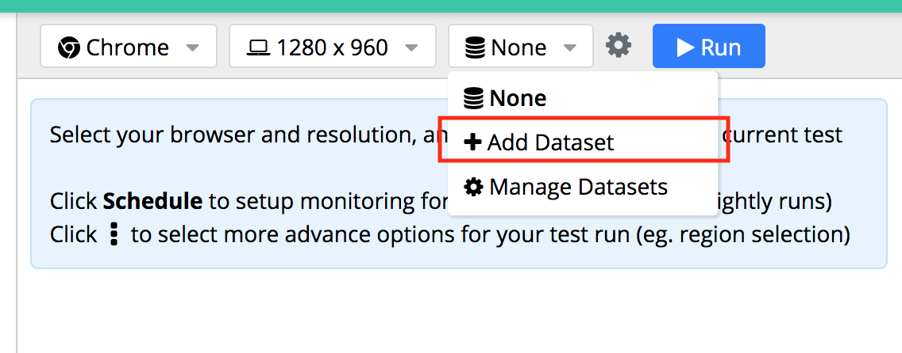
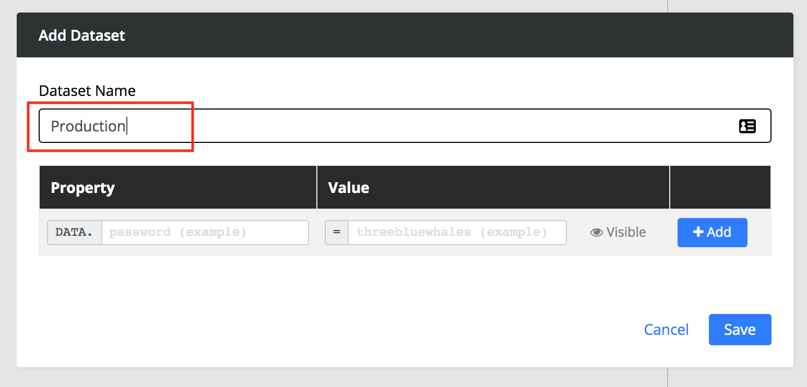
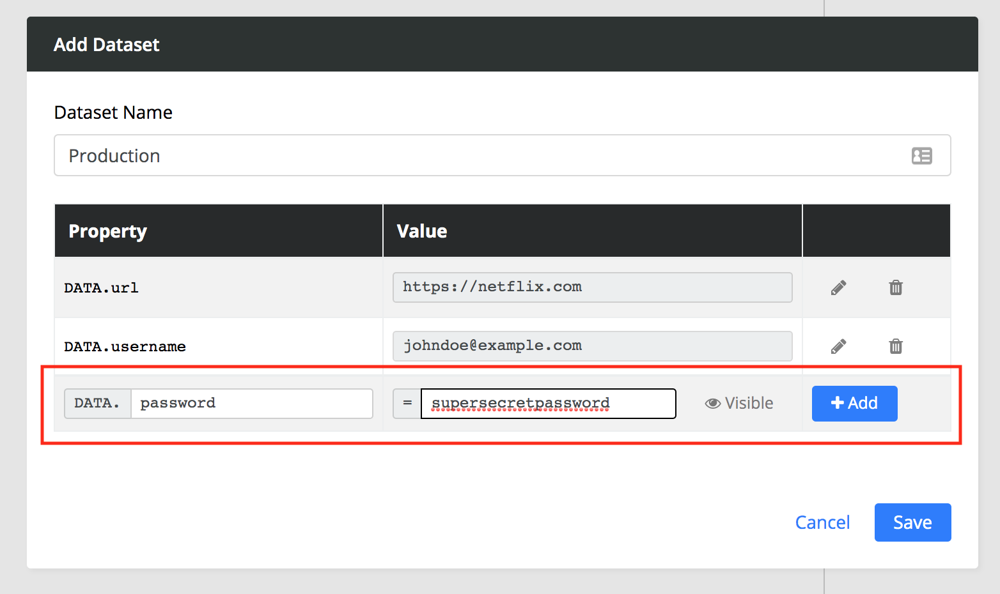
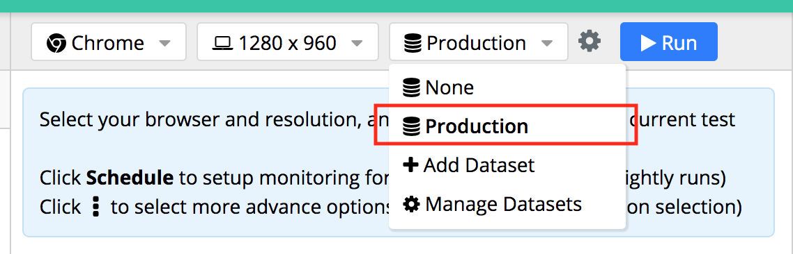
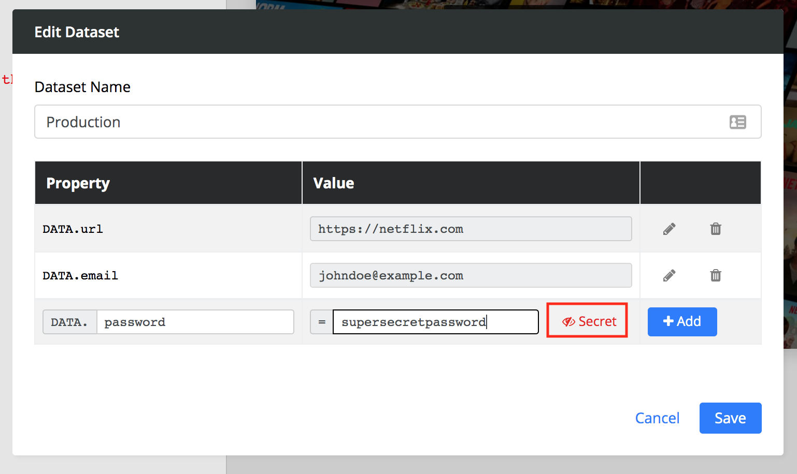
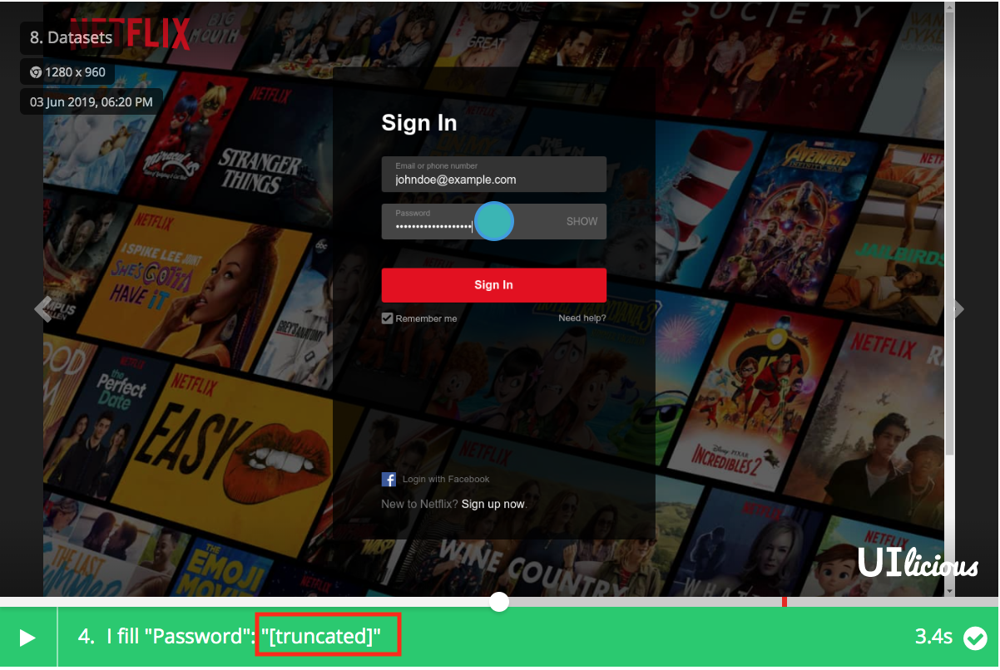

# Datasets

Datasets can be used to swap test data quickly between runs and to manage sensitive test data securely.

## Creating and using datasets

In Editor Tab, click on the "Dataset" dropdown on the "Result" Pane Toolbar, and "Add Dataset" option to create a dataset.



Enter a name for the dataset, e.g. "Production".



To add a property to the dataset, enter the property name and value, and press "Add".



Save the dataset. You should see the new dataset in your "Dataset" dropdown.



When a dataset is selected, the properties and values will be loaded to the `DATA` object. You can reference the properties in the dataset like this:

```javascript
I.goTo(DATA.url);
I.click("Sign In");
I.fill("Email", DATA.email);
I.fill("Password",  DATA.password);
I.click("Sign in"); 
I.see("Incorrect password");
```

Select a dataset and run the test, the values from the selected dataset will be used during the run:

Selecting the "Production" dataset created, these are the values that will ran with the test:
```javascript
I.goTo(DATA.url); // DATA.url will be set to "https://netflix.com"
I.click("Sign In");
I.fill("Email", DATA.email); // DATA.email will be set to "johndoe@example.com"
I.fill("Password",  DATA.password); // DATA.password will be set to "supersecretpassword"
I.click("Sign in"); 
I.see("Incorrect password");
```

## Securing sensitive test data

You can manage sensitive test data such as passwords with secret properties in Datasets. The values of secret properties will be masked in the dataset editor and in the test run report so that you can share them without revealing sensitive test data. 

When adding a property, change the visibility of the property from "Visible" to "Secret". Let's set password to "Secret".



Secret properties are masked in the test run reports.


