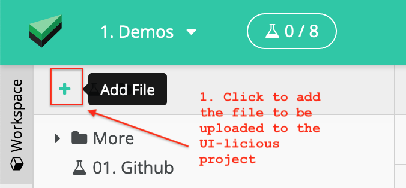
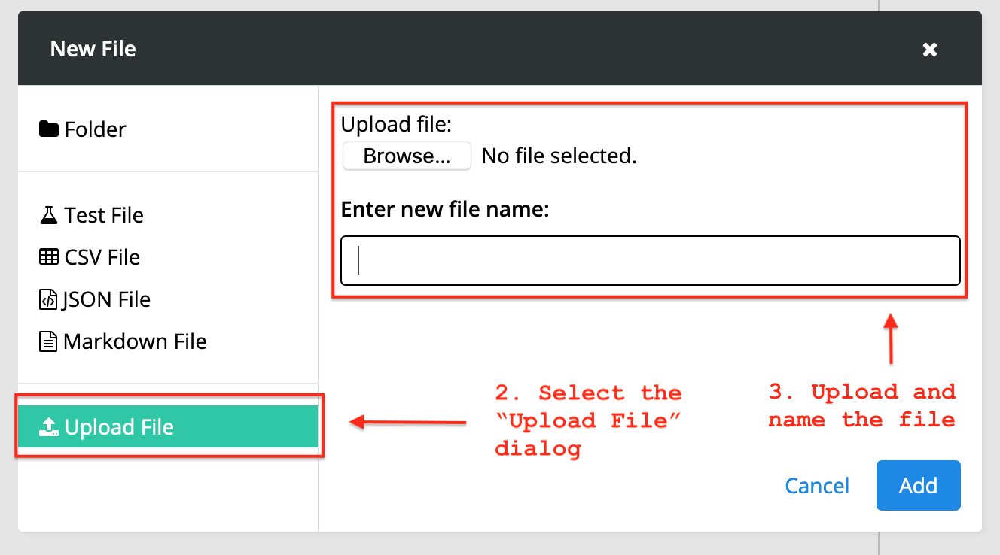
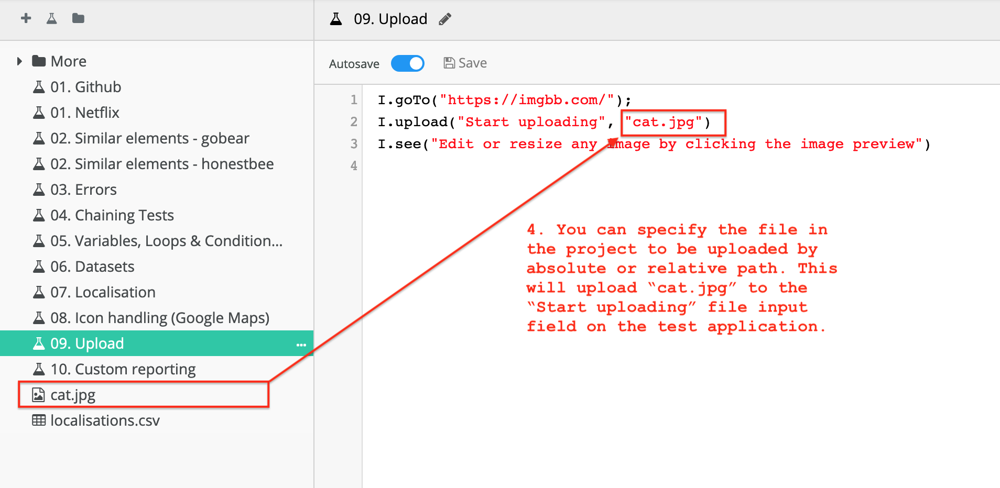

# Form input commands

These commands are used to set values for form input and validate form inputs.

## List of commands

### Input commands

| Command | Description|
|---------|------------|
| [`I.fill`](#ifill) | Fill a textual field |
| [`I.select`](#iselect) | Select a dropdown option, checkbox, or radio button |
| [`I.deselect`](#ideselect) | Deselect a checkbox |
| [`I.upload`](#iupload) | Upload a file |

### Assertion / Validation commands
| Command | Description|
|---------|------------|
| [`I.filled`](#ifilled) |  Assert that the form is filled with a specific value |
| [`I.selected`](#iselected) |  Assert that a dropdown option, checkbox, or radio button is selected |
| [`I.deselected`](#ideselected) |  Assert that a dropdown option, checkbox, or radio button is NOT selected |

---

## `I.fill`

> Short form of `I.fillField` command

Fill a textual field.

This works for date picker fields that accept direct text input.

### Usage
```javascript
I.fill(field, value)
```

#### Parameters
| Parameter | Type | Remarks|
|----------|------|--------|
| field | string | Keyword to identify the field. <br> The associated label, aria-label, placeholder, adjacent text, and current value can be used to identify a field. <br>  CSS selectors can also be used, *but is not recommended as it makes the tests harder to keep up to date.* |
| value | string | Value to fill into the field |

### Example(s)

#### Fill a field

```javascript
I.fill("Email", "bruce@waynecorp.com");
```
This command fills "bruce@waynecorp.com" into the "Email" field.

#### Clear a field

```javascript
// fill with empty value
I.fill("Email", "");

// or
I.clear("Email");
```
This command clears the "Email" field.

---

## `I.filled`

Asserts that the form is filled with a specific value

### Usage

```javascript
I.filled(field, value)
```

#### Parameters

| Parameter | Type | Remarks|
|-----------|------|--------|
| field | string | Keyword to identify the field. <br> The associated label, placeholder, adjacent text, and name can be used to identify a field. <br>  CSS selectors can also be used, *but is not recommended as it makes the tests harder to keep up to date.* |
| value | string | Value that the field is expected to have |

---

## `I.select`

Select a dropdown, checkbox, or radio button.

> **This -ONLY- works on native HTML5 elements.** <br>
> <br>
> For custom elements, use `I.click` as a fallback. <br>

### Usage

Select an `option`:
```javascript
I.select(option)
```

Select an `option` in a `list`:
```javascript
I.select(list, option)
```

#### Parameters
| Parameter | Type | Remarks|
|----------|------|--------|
| list | string | (Optional) Keyword to identify the options list |
| option | string | Keyword to identify the option to select |

### Example(s)

#### Select a dropdown

Here, we will use this "Number" dropdown list for illustration.


<div style='margin-left: 16px; margin-bottom: 16px'>
    <label for='number-dd'><b>Number</b></label>
    <select id='number-dd' name='number'>
        <option value=''></option>
        <option value='one'>One</option>
        <option value='two'>Two</option>
        <option value='three'>Three</option>
    </select>
</div>


Specify the `option`;
```javascript
 I.select("Two");
```

Or, specify the `list` and the `option`:
```javascript
I.select("Number", "Two");
```

This selects the option "Two".

#### Select a checkbox

Here, we will use this check box for illustration.


<div style='margin-left: 16px; margin-bottom: 16px'>
    <label style='margin-left:16px'><input type='checkbox' name="agree"/> I agree to the terms and conditions </label>
</div>


```javascript
I.select("I agree to the terms and conditions");
```
This selects the checkbox "I agree to the terms and conditions".

#### Select a check box in a checkbox list

Here, we will use this "Color" checkbox list for illustration.


<div style='margin-left: 16px; margin-bottom: 16px'>
    <b>Color</b>
    <label style='margin-left:16px'><input type='checkbox' name="color"/> Red </label>
    <label style='margin-left:16px'><input type='checkbox' name="color"/> Blue</label>
    <label style='margin-left:16px'><input type='checkbox' name="color"/> Green </label>
</div>


Specify the `option`;
```javascript
I.select("Red");
```
Or, specify the `list` and the `option`:
```javascript
I.select("Color", "Red");
```

This selects the option "Red".

#### Select a radio button

Here, we will use this "Animal" radio button list for illustration.


<div style='margin-left: 16px; margin-bottom: 16px'>
    <b>Animal</b>
    <label style='margin-left:16px'><input type='radio' name="animal"/> Cat </label>
    <label style='margin-left:16px'><input type='radio' name="animal"/> Dog</label>
    <label style='margin-left:16px'><input type='radio' name="animal"/> Mouse </label>
</div>


Specify the `option`;
```javascript
I.select("Cat");
```

Or, specify the `list` and the `option`:
```javascript
I.select("Animal", "Cat");
```

This selects the option "Cat".

---

## `I.selected`

Asserts that a dropdown option, checkbox, or radio button is selected

### Usage

```javascript
I.selected(option)
```

```javascript
I.selected(list, option)
```

#### Parameters

| Parameter | Type | Remarks|
|-----------|------|--------|
| list | string | Keyword to identify the options list |
| option | string | Keyword to identify the option to be selected |

---

## `I.deselect`

Deselect a checkbox.

### Usage
Deselect an `option`:
```javascript
I.deselect(option)
```

Deselect an `option` in a `list`:
```javascript
I.deselect(list, option)
```

#### Parameters
| Parameter | Type | Remarks|
|-----------|------|--------|
| list (optional) | string | Keyword to identify the options list |
| option | string | Keyword to identify the option to deselect |

---

## `I.deselected`

Asserts that a dropdown option, checkbox, or radio button is NOT selected

### Usage

```javascript
I.deselected(option)
```

```javascript
I.deselected(list, option)
```

#### Parameters

| Parameter | Type | Remarks|
|-----------|------|--------|
| list | string | Keyword to identify the options list |
| option | string | Keyword to identify the option that expected to be NOT selected |

---

## `I.upload`

Upload a file.

### Usage
```javascript
I.upload(field, pathToFile)
```

#### Parameters
| Parameter | Type | Remarks|
|-----------|------|--------|
| field | string | Keyword to identify the file upload field |
| pathToFile | string | Path to the file to upload. <br> **Currently, only absolute paths from the project root are supported.** |

### Example

First, you need to add the file to be used for testing file upload to the UI-licious test project. 

Click on the "plus" button in the workspace pane to open the "Add file" dialog.

<div class="screenshot">
    
</div>

Select the "Upload file" menu, and upload the file to the project.

<div class="screenshot">
    
</div>

Finally, specify the absolute or relative path to the file in the `I.upload` command. 

<div class="screenshot">
    
</div>

This will upload "cat.jpg" to the "Start uploading" file input field in our test application.


